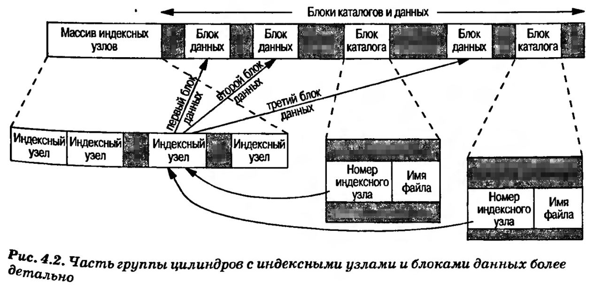
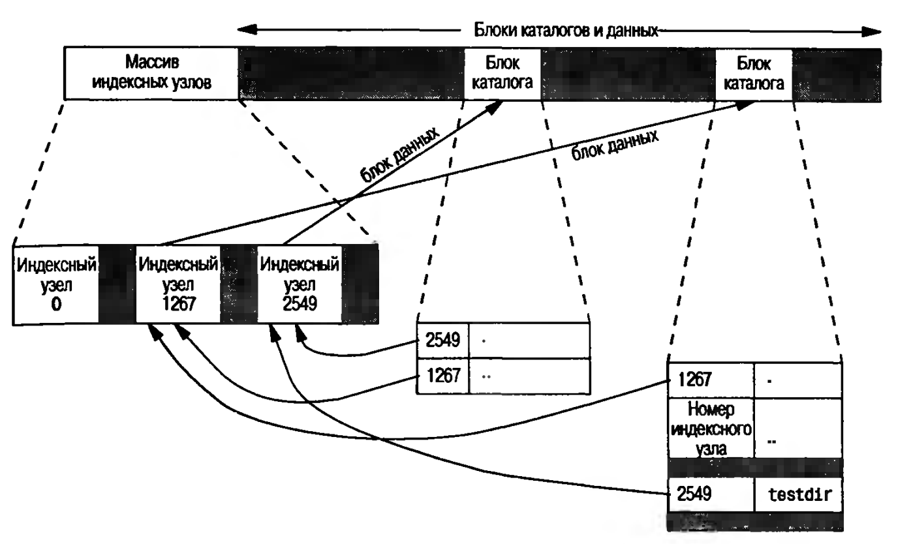
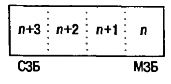
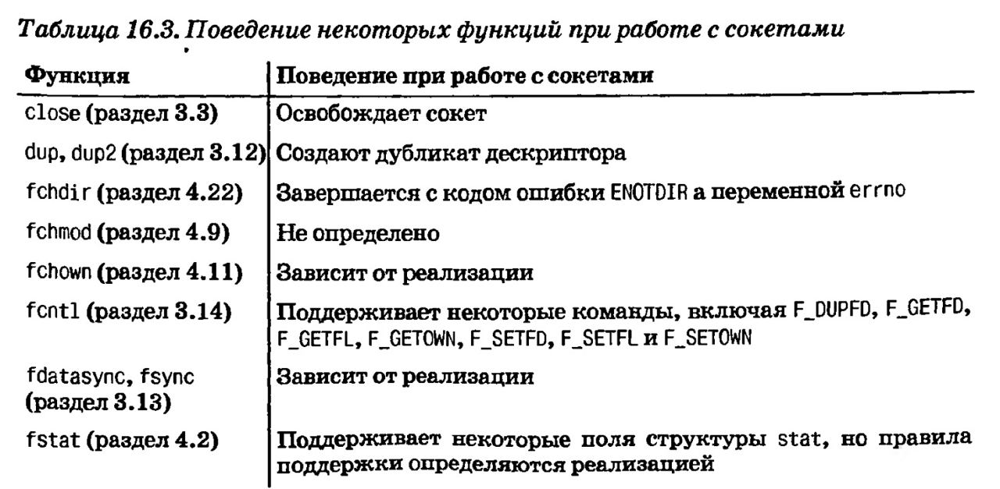
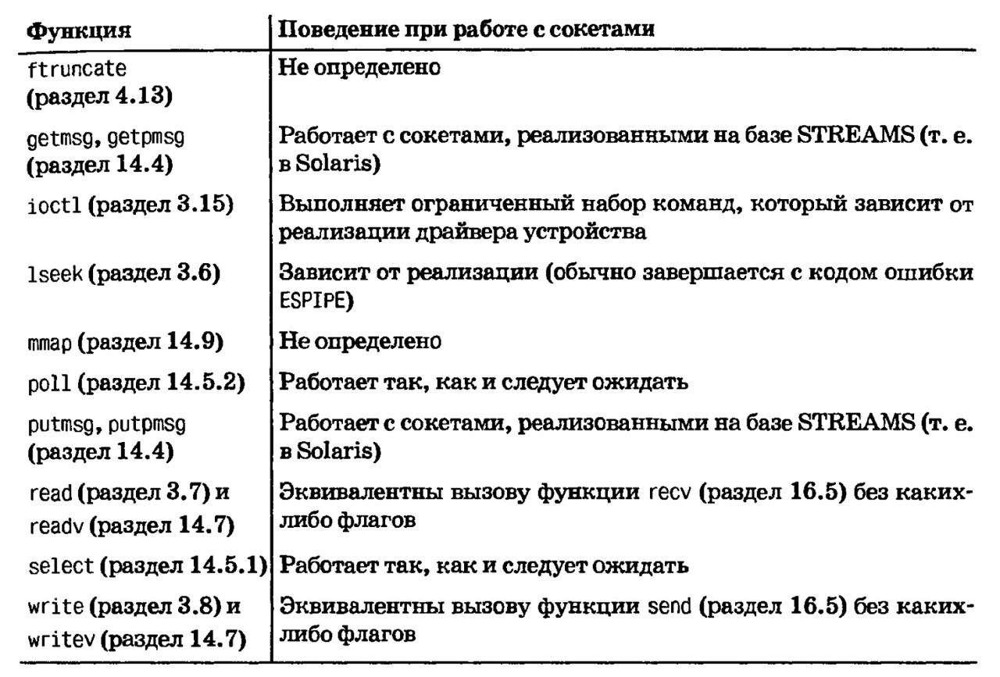
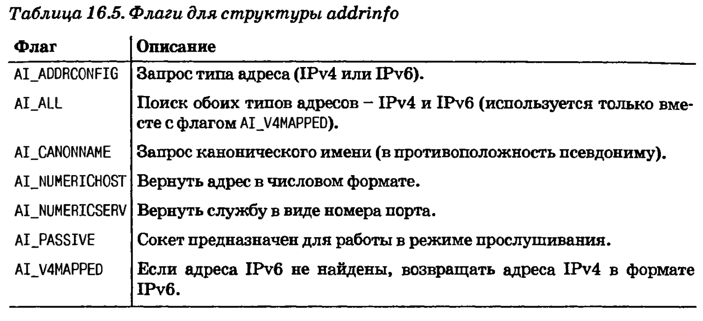

# Файловая система

## Определения из лекции

**Файл** (Оксвордский словарь вычислительной техники) -- это информация хранимая во вторичной памяти или во вспомагательном запоминающем устройстве с целью ее сохранения после завершения отдельного задания или преодоления ограничений связанных с объемом основного запоминающего устройства.

В файле могут содержаться данные, программы, тексты и любая другая информация.

**Файл** (Рязанова) -- поименованная совокупность данных, хранимая во вторичной памяти.

**Файловая система** -- это порядок, определяющий способ организации хранения, именования и доступа к данным на вторичных носителях информации.

> Вторичная память обеспечивает **долговременное хранение** (то есть она должна быть энерго независимой)

**Задача файловой системы** -- обеспечивать сохранение данных и доступ к сохраненным данным.

----

Разберемся в общих чертах в устройстве файловой системы UNIX. Представим себе диск, поделенный на несколько разделов. Каждый из разделов может содержать файловую систему, как показано на рисунке.


**Индексные узлы** -- это записи фиксированной длины, которые содержат большую часть сведений о файлах.

* тип файлаа
* биты прав доступа
* размер файла
* указатели на блоки данных файла

Файл каталога содержит такую информацию, как 

* имя файла
* номер индексного узла

Присмотревшись ближе к той части группы цилиндров, где находятся индексные узлы и блоки данных, можно увидеть следующую картину



Особенности:

1. Здесь есть две зааписи в файле каталога, которые ссылаются на один и тот же индексный узел. При этом каждый индексный узел имеет счетчик ссылок, где хранится число записей в файле каталога, которые ссылаются на данный индексный узел.

   0 -> файл удален -> блоки данных, связанные с файлом, перешли в список свободных блоков

   Поэтому unlink (отцепить) != delete (удалить)

2. Нельзя создать каталожную запись, которая указывала бы на индексный узел в другой файловой системе

3. При переименовании/перемещении файла в пределах одной и той же ФС фактическое содержимое файла никуда не перемещается. В каталог добавляется новая запись, которая указывает на существующий индексный узел, а старая запись отцепляется.

### Счетчик ссылок для каталога

Выполним команду `mkdir testdir`



# Сокеты

Сокет -- это абстракция конечной точки взаимодействия. 

## Дескриптор сокета

Для работы с сокетами используются дескрипторы сокетов, которые в юникс организованы так же, как дескрипторы файлов. 

```c
#include <sys/socket.h>

int socket(int domain, int type, int protocol);
// Создает дескриптор сокета и возвращает его в случае успеха, -1 в случае ошибки
```

### domain

Аргумент domain определяет природу взаимодействия, включая формат адреса.

| Домен       | Описание             |
| ----------- | -------------------- |
| `AF_INET`   | Домен Интернета IPv4 |
| `AF_INET6`  | Домен Интернета IPv6 |
| `AF_UNIX`   | Домен UNIX           |
| `AF_UNSPEC` | Неопределенный домен |

> Имена констант начинаются с префикса AF_ (address family - семейство адресов), потому что каждый домен обладает своим собственным форматом представления адресов.

### type

Тип сокета, который определяет характеристики взаимодействия. 

| Тип              | Описание                                                     |
| ---------------- | ------------------------------------------------------------ |
| `SOCK_DGRAM`     | Не ориентированы на создание логического соединения, сообщения фиксированной длинны, доставка сообщений не гарантируется |
| `SOCK_RAW`       | Интерфейс дейтаграмм к протоколу IP                          |
| `SOCK_SEQPACKET` | Ориентированы на создание логического соединения, упорядоченность передачи данных, сообщения фиксированной длины, гарантируется доставка сообщений |
| `SOCK_STREAM`    | Ориентированы на создание логического соединения, упорядоченность передачи данных, гарантируется доставка сообщений, двунаправленный поток байтров. |

### protocol

Обычно передается 0, чтобы выбрать значение по умолчанию для данного домена и типа сокета. 

| Домен     | Тип              | Протокол по умолчанию                                        | Особенности                                                  |
| --------- | ---------------- | :----------------------------------------------------------- | ------------------------------------------------------------ |
| `AF_INET` | `SOCK_STREAM`    | `TCP` (Transmission Control Protocol) -- протокол управления передачей данных | Потоки байтов требуют, чтобы перед началом обмена данными между нашим сокетом и сокетом, принадлежащим сетевому узлу, с которым предполагается взаимодействовать, было установлено логическое соединение (аналогия -- телефонный звонок) |
| `AF_INET` | `SOCK_DGRAM`     | `UDP` (User Datagram Protocol) -- протокол пользовательских дейтаграмм | Дейтаграммы -- это служба, не ориентированная на установление логического соединения.  <br /> <br />При использовании дейтаграмм не требуется устанавливать логическое соединение. Все, что нужно сделать -- это переда ть сообщение по адресу сокета, который используется процессом на другом конце (аналогия -- письма по почте) |
| `AF_INET` | `SOCK_SEQPACKET` | `SCTP` (Stream Control Tramsmission Protocol) -- протокол передачи с управлением потоком | Услуга передачи отдельных сообщений -- очень похожи на  `SOCK_STREAM`, но вместо приема/передачи в виде потока байтов, могут работать с отдельными сообщениями |
| `AF_INET` | `SOCK_RAW`       | `IP` ?                                                       | Сокеты `SOCK_RAW` представляют собой интерфейс дейтаграмм на сетевом уровне (то есть интерфейс к протоколу `IP` в домене интернет). При использовании этого интерфейса вся ответственность за построение заголовков пакетов возлагается на приложения (так как не используются протоколы транспотрного уровня TCP или UDP). Приложению нужно обладать правами суперпользователя. |


## Функции для работы с сокетами

Приведу перечень самых основных (остальные можно посмотреть в приложении)

| Функция | Поведение при работе с сокетом                           |
| ------- | -------------------------------------------------------- |
| `close` | Освободить сокет                                         |
| `read`  | Эквивалентно вызову функции `recv` без каких-либо флагов |
| `write` | Эквивалентно вызову функции `send` без каких-либо флагов |

Обмен данными через сокеты является двунаправленный. Выполнение отделных операций над сокетами можно запретить с помощью функции `shutdown`

```c
#include <sys/socket.h>

int shutdown(int sockfd, int how);
// how == SHUT_RD - запретить чтение из сокета
// how == SHUT_WR - запретить запись в сокет
// how == SHUT_RDWR - запретить возможность передачи в обоих направлениях
```

Отличия `shutdown` от `close`:

1. `close` закроет соединение и освободит дескриптор только тогда, когда будет закрыта последняя активная ссылка на сокет. `shutdown` позволяет деактивировать сокет независимо от количества ссылающихся на него активных дескриптов.
2. Возможность запретить передачу данных в одном направлении. 

## Адресация

Как происходит идентификация процесса, с которым мы хотим взаимодействовать? Идентификационная част состоит из двух частей:

1. Сетевой адрес компютера 

   Позволяет идентифицировать сетевой узел, с которым мы предполагаем вступить в контакт

2. Номер службы 

   Позволяет идентифицировать конкретный процесс на этом компьютере

### Порядок байтов

-- характеристика аппаратной архитектуры процессора, определяющая, в каком порядке следуют байты в данных длинных типов (н. целые числа).

| Название                 | Описание                                             | Иллюстрация                                |
| ------------------------ | ---------------------------------------------------- | ------------------------------------------ |
| Обратный (`big-endian`)  | В старшем адресе располагается младший значащий байт |  |
| Прямой (`little-endian`) | Младщий значащий байт хранится в младщем адресе      |  |

```
!!! Независимо от порядка байт СЗБ всегда слева, а МЗБ - справа.
0x04030201 - СЗБ имеет значение 4, младщий 1, независимо от порядка байтов.

Порядок проявляется в ссылках: если сделать char *, то
  -- на машине с прямым порядком cp[0] ссылается на младщий байт -> 1
  -- на машине с обратным порядком cp[0] ссылается на старший -> 4
```

| ОС            | Архитектура процессора | Порядок  |
| ------------- | ---------------------- | -------- |
| FreeBSD 5.2.1 | Intel Pentium          | Прямой   |
| Linux 2.4.22  | Intel Pentium          | Прямой   |
| Mac OS X 10.3 | PowerPC                | Обратный |
| Solaris 9     | Sun SPARC              | Обратный |

### Порядок байт в протоколах

При использовании протоколов TCP/IP используется **сетевой (обратный)** порядок байтов.

Преобразования между сетевым и аппаратным порядком производятся с помощью следующих функций

```c
#include <arpa/inet.h>

uint32_t htonl(uint32_t hostint32); // вернуть 32-битное целое с сетевым порядком байтов
uint16_t htons(uint16_t hostint16); // вернуть 16-битное целое с сетевым порядком байтов

uint32_t ntohl(uint32_t netint32);  // вернуть 32-битное целое с аппаратным порядком байтов
uint16_t ntohs(uint16_t netint16);  // вернуть 16-битное целое с аппаратным порядком байтов
```

> n -- network (сетевой порядок байтов)
>
> h -- host (аппаратный)
>
> l -- long 
>
> s -- short

### Форматы адресов

Адреса используются для идентификации сокетов в конкретном домене. Обощенная структура адреса:

```c
struct sockaddr {
  sa_family sa_family; /* семейство адресов */
  char 			sa_data[]; /* адрес переменной длины */
  ...
}
```

Формат представления адресов Интернетаа определен в заголовочном фале `<netinet/in.h`. Адреса сокетов из домена `IPv4` представлены структурой 

```c
struct in_addr {
  in_addr_t s_addr; 		/* 	адрес IPv4 */
};

struct sockaddr_in {
  sa_family      sa_family;   /* семейство адресов */
  in_port_t      sin_port;    /* номер порта */
  struct in_addr sin_addr;    /* адрес IPv4 */
}
```

Адреса сокетов домена Интернет IPv6 представлены структурой `sockaddr_ip6`.


Иногда возникает необходимость выводить адреса в виде, удобном для человека. Для этого есть функции:

* `inet_ntop` -- преобразует адрес из двоичного представления с сетевым порядком батов в текстовую строку
* `inet_pton` -- преобразует текствую строку в двоичное представление с сетевым порядком байтов.

```c
#include <anpa/inet.h>
cons chat *inet_ntop(int domain, const void *restrict addr,
                    char *restrict str, socklen_t size);
/* Возвращает указатель на строку с адресом в случае успеха, NULL в случае ошибки */
```

```c
int inet_pton(int domain, const char *restrict str, void *restrict addr);
/* Возвращает 1 в случае успеха, 0 при неверном формате, -1 в случае ошибки */
```

## Определение адреса

> 📍 В идеале приложения ничего не должны знать о внутренней структуре адреса сокета. 

Информация о конфигурации сети может храниться в статических файлах (`/etc/hosts`, `/etc/services` и другие) или предоставляться различными сетевыми службами, такими как `DNS` (Domain Name System -- система доменных имен) и `NIS` (Network Information Service -- сетевая информационная служба). Независимо от того, где хранится информация, для доступа к ней используются одни и те же функции.

Адреса хостов, известных заданной системе, могут быть получены с помощью функции `gethostent`.

```c
#include <netdb.h>
struct hostent *gethostent(void); 
// Возвращает указатель на очередную запись из файла с данными об адресах или NULL

void sethostent(int stayopen);
// Открывает файл или переходит в его начало, если он уже открыт

void endhostent(void);
// Закрывает файл
```

Когда функция `gethostent` возвращает управление, мы получаем указатель на структуру `hostent`, которая может размещаться в области статической памяти, которая будет затерта при следующем обращении к этой функции.

```c
struct hostent {
  char *h_name;					/* имя хоста */
  char **h_aliases;			/* указатель на массив псевдонимов */
  int h_addrtype; 			/* тип адреса */
  int h_length;					/* длина адреса в байтах */
  char **h_addr_list;		/* указатель на массив сетевых адресов */
  ...
}
```

Возвращаемые адреса имеют **сетевой порядок байтов**.

Получение имен сетей и их номеров (номер сети имеет сетевой порядок байтов):

```c
#include <netdb.h>
struct netent *getnetbyaddr(uint32_t net, int type);
struct netent *getnetbyname(const char *name);
struct netent *getnetent(void);
// Все возвращают указатель в случае успеха, NULL в случае ошибки

void setnetent(int stayopen);
void endnetent(void);

struct netent {
  char *n_name;			/* имя сети */
  char **n_aliases;	/* указатель на массив псевдонимов сети */
  int n_addrtype;   /* тип адреса */
  unit32_t n_net;		/* номер сети */
  ...
}
```

Преобразования между именами протоколов и их номерами производятся с помощью следующих наборов функций:

```c
#include <netdb.h>
struct protoent *getprotobyname(const chat *name);
struct protoent *getprotobynumber(int proto);
struct protoent *getprotoent(void);
// Все возвращают указатель в случае успеха, NULL в случае ошибки

void setprotoent(int stayopen);
void endproroent(void);

struct protoent {
  char *p_name;				/* имя протокола */
  char **p_aliases;		/* указатель на массив псевдонимов протокола */
  int p_proto;				/* номер протокола */
}
```

Службы определяются номером порта, который является частью адреса. Каждой сетевой службе присвоен свой уникальный номер порта

```c
#include <netdb.h>
struct servent *getservbyname(const char *name, const char *proto);
// Получить номер порта по имени службы

struct servent *getservbyport(int port, const char *proto);
// Получить имя службы по номеру порта

struct servent *getservent(void);
// Последовательно посмотрет все записи в базе данных служб

void setservent(int stayopen);
void endservent(void);

struct servent {
  char *s_name;				/* имя службы */
  char ** s_aliases;  /* указатель на массив псведонимов службы */
  int s_port;					/* номер порта */
  char *s_proto;			/* имя протокола */
  ...
}
```

Получить сетевой адрес из имени хоста и имени службы.

```c
#include <sys/socket.h>
#include <netdb.h>

int getaddrinfo(const char *restrict host, const char *restrict service,
               const struct addrinfo *restrict hint,
               struct addrinfo **restrict res);
void freeaddrinfo(struct addrinfo *ai);

struct addrinfo {
  int ai_flags;										// флаги
  int ai_family;									// семейство адресов
  int ai_socktype;								// тип сокета
  int ai_protocol;								// протокол
  socklen_t ai_addrlen;						// длина адреса в байтах 
  struct sockaddr *ai_addr;				// адрес
  char *ai_canonname;							// каноническое имя хоста
  struct addrinfo *ai_next;				// следующий элемент списка
}

// Флаги для работы с этой структурой можно посмотреть в приложении
```

## Присвоение адресов сокетам

Адрес, присваиваемый клиентскому сокету, не представляет для нас особого интереса, и потому мы можем позволить системе выбирать адрес по умолчанию. Однако для сервера очень важно присвоить сокету преопределенный адрес, на который клиенты будут присылать запросы. Клиентам необхоидимо заранее знать требуемый адрес, чтобы войти в контакт с сервером.

Самое простое решение -- зарезервировать адрес сервера в файле `/etc/services` или в службе имен.

```c
#include <sys/socket.h>
int bind(int sockfd, consst struct sockaddr *addr, socklen_t len);
// Ассоциируем адрес с сокетом
```

Ограничения:

* Указываемый адрес должен быть действительным адресом для машины, на которой выполняется процесс -- мы не может задать адрес, который принадлежит другой машине.
* Формат адреса должен совпадать с форматом, который поддерживается семейством адресов, указанным при создании сокета.
* Номер порта не может быть меньше 1024, если процесс не имеет соответствующих привилегий
* Обычно каждый конкретный адрес может быть связан только с одним сокетом, хотя некоторые протоколы допускают присвоение одного и того же адреса нескольким сокетами.

В домене Интернет имеется специальный IP-адрес `INADDR_ANY`, который соответствует адресам всех сетевых интерфейсов в системе.

Чтобы получить адрес, присвоенный сокету, можно использовать функцию `getsockname`.

```c
#include <sys/socket.h>
int getsockname(int sockfd, struct sockaddr *restrict addr,
               socklen_t *restirct alenp);
```

Если сокет соединен с удаленным узлом, мы можем получить адрес удаленного узла, обратившись к функции `getpeername`.

```c
#include <sys/socket.h>
int getpeername(int sockfd, struct sockaddr *restrict addr,
               socklen_t *restrict alenp);
```

## Установление соединения

Если мы имеем дело с сетевой службой, которая ориентирована на установление логического соединения (`SOCK_STREAM`, `SOCK_SEQPACKET`), то прежде, чем начать обмениваться данными, необходимо установить соединение между сокетом процесса, посылающего запрос, и процессом, предоставляющим услугу (сервером). Для создания соединения используется функция `connect`.

```c
#include <sys/socket.h>
int connect(int sockfd, const struct sockaddr *addr, socklen_t len);
```

Возможные причины ошибок:

* машина, с которой мы пытаемся установить соединение, не включена или не связана с сетью
* серверу не присвоен адрес, с которым мы пытаемся соединиться
* гет места в очереди запросов на соединение на стороне сервера

> Приложение может определить, когда декстриптор станет доступен для записи, с помощью функции `poll` или `select`.

В целом `connect ` может использоваться и для работы со службами, которые не требуют установления соединения. В этом случае это будет оптимизацией, так как освободит нас от необходимости указывать адрес при передааче каждой дейтаграммы. + мы будем получать дейтаграммы только с указанного адреса.

С помощью функции `listen` сервер заявляет о своем желании принимать запросы на установление соединения.

```c
#include <sys/socket.h>
int listen(int sockfd, int backlog);
// backlog -- максимальный размер очереди запросов
```

Функция `accept` принимает запрос и преобразует его в соединение.

```c
#include <sys/socket.h>
int accept(int sockfd, struct sockaddr *restrict addr, socklen_t *restrict len);
// Возвращает дескриптор сокета, соединенного с клиентом
```

## Передача данных

Мы можем использовать функции `read` и `write`.

### Функции передачи данных

* `send` -- похожа на `write`, но в отличие от нее позовляет указывать доп флаги

  ```c
  #include <sys/socket.h>
  ssize_t send(int sockfd, const void *buf, size_t nbytes, int flags);
  ```

  | Флаг            | Описание                                                     |
  | --------------- | ------------------------------------------------------------ |
  | `MSG_DONTROUTE` | Не отправлять пакет за пределы локальной сети                |
  | `MSG_DONTWAIT`  | Разрешить неблокирующий режим выполнения операции            |
  | `MSG_EDR`       | Обозначаает конец записи, если поддерживается проколом       |
  | `MSG_OOB`       | Обозначает передачу экстренных данных, если поддерживается протоколом |

  Все что гарантирует функция -- отсутствие ошибок при передаче данных сетевым драйверам (то есть не факт, что на другом конце соединения получат норм данные)

* `sendto` -- отличие от `send` в том, что она позволяет указать адрес получателя при работе с сокетами типа `SOCK_DGRAM`

  ```c
  #include <sys/socket.h>
  ssize_t sendto(int sockfd, const void *buf, size_t nbytes, int flags,
                const struct sockaddr *destaddr, socklen_t destlen).
  ```

* `sendmsg` 

  ```c
  #include <sys/socket.h>
  ssize_t sendmsg(int sockfd, const struct msghdr *msg, int flags);
  ```

  ```c
  struct msghdr {
    void *msg_name;						// необязательный адрес 
    socklen_t msg_namelen;		// размер адреса в байтах
    struct iovec *msg_iov;    // массив буферов ввода-вывода
    int msg_iovlen;           // количество элементов в массив
    void *msg_control;        // вспомогательные данные
    socklen_t msg_controllen; // объес вспомогательных данных в байтах
    int msg_flags;            // флаги принятого сообщения
    ...
  }
  ```

### Функции приема данных

* `recv` -- похожа на `read`, но в отличин от нее позволяет указать доп флаги

  ```c
  #include <sys/socket.h>
  ssize_t recv(int sockfd, void *buf, size_t nbytes, int flags)
  ```

  | Флаг          | Описание                                                  |
  | ------------- | --------------------------------------------------------- |
  | `MSG_OOB`     | Принять экстренные данные, если поддерживается протоколом |
  | `MSG_PEEK`    | Вернуть содержимое пакета, но не удалять его из очереди   |
  | `MSG_TRUNC`   | Запросить, чтобы был возвращен реальный размер пакета     |
  | `MSG_WAITALL` | Ждат, пока не будут получены все данные                   |

*  `recvfrom` -- возвращает адрес, с которого была произведена передача данных

* `recvmsg` -- принять данные сразу в несколько буферов (665 стр)

## Приложение

Функции работы с сокетами





Флаги для стукрутры addrinfo


