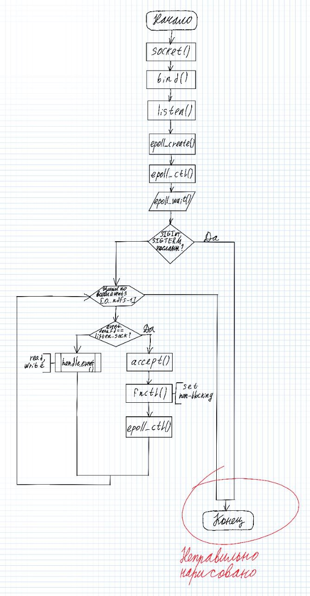

## Лабораторная работа №2

Автор лабы: [@Andrey Sapozhkov](https://github.com/Inspirate789) 

```
📍 не забудьте поставить ему звездочку !!!
```

### Описание

Берем задачу 3 из первой ЛР и добавляем туда **epoll**. *Спойлер*: ищите ноут на линуксе, потому что нигде больше это не запустится (если все-таки захотите mac, то нужно переписывать на poll).

### Что вам может помочь

* дока по epoll [[man]](https://man7.org/linux/man-pages/man7/epoll.7.html)
* дока на русском [[man]](https://ru.manpages.org/epoll/7)
* общая идея [[habr]](https://habr.com/ru/post/416669/)
* описание флагов EPOLLIN и EPOLLET [[man]](https://www.opennet.ru/man.shtml?topic=epoll_ctl&category=2&russian=0) (**важно**) 
* картинка "как это работает" (не смотрите, что написано неправильно, она так принимает)



### Вопросы

* Какой `fd` принимает `accept`? -> `listen_sock`
* Что за файловый дескриптор в `accept`? -> исходный
* Что за проверка, почему ветвимся? -> проверка на то, что созданный сокет является исходным
* В каком состоянии возвращает сокет accept? -> копия будет в состоянии `connected` (accept возвращает дескриптор файла нового сокета).
* В каком состоянии будет исходный сокет после `accept`? -> исходный сокет остается в состоянии `listen`


